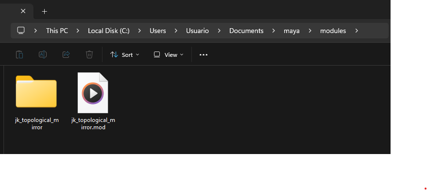
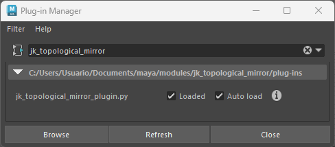
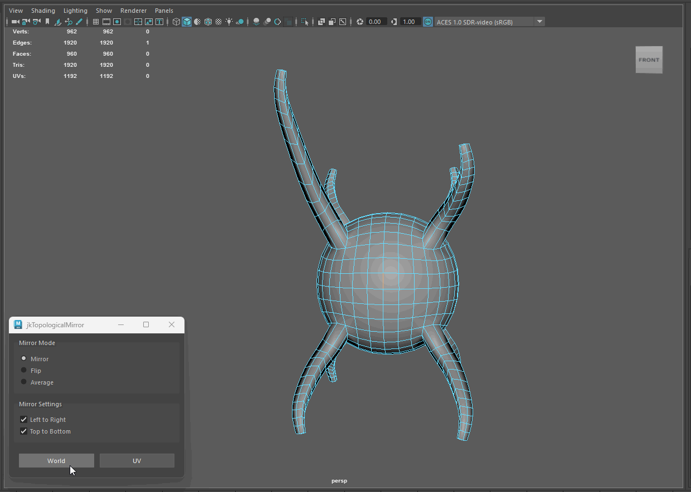
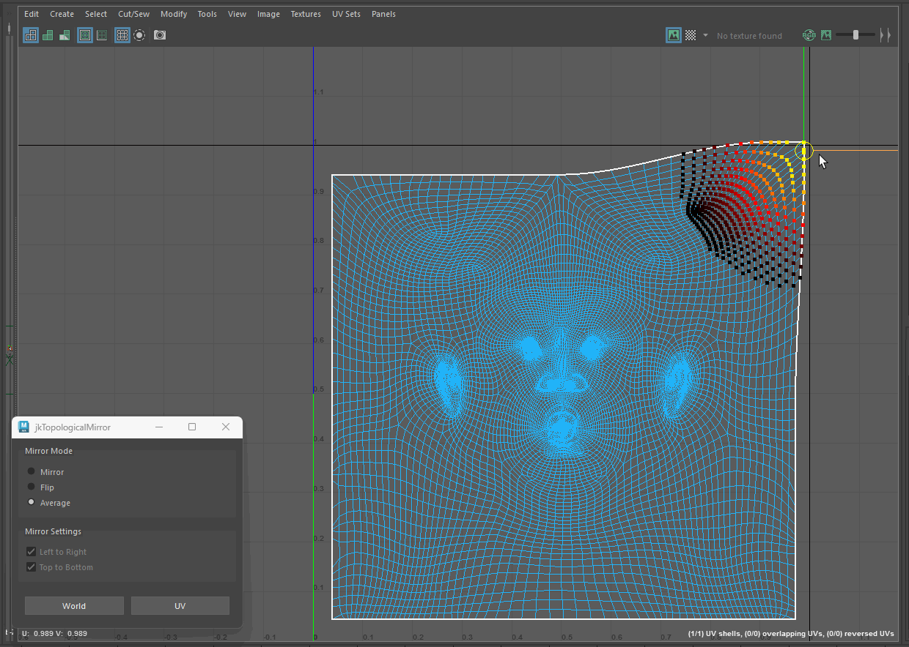

# JK Topological Mirror

A Maya plugin for establishing symmetry based on mesh topology.


---

## Features

* Three Mirror Modes:
    * Mirror: Mirrors one side to the other.
    * Flip: Swaps sides.
    * Average: Balances both sides using the average of their coordinates.
* Camera-Aware: Mirror based on viewport orientation.
* Vertex & UV Support: Mirror geometry or texture coordinates.

## Prerequisites

| Requirement | Specification |
| :--- | :--- |
| **Maya Version** | 2022+ (Python 3.7+) |
| **Geometry** | Manifold, consistent topology |

## Installation

1. Download and extract the contents of [jk_topological_mirror.zip](https://github.com/JakobJK/jk_topological_mirror/archive/main.zip) to a temporary location.
2. Unzip, and copy the content of the `./src` directory to a Maya Module Folder. If the folder doesn't already exists, create it.
    - **Windows:** `%USERPROFILE%\Documents\maya\modules`
    - **macOS:** `~/Library/Preferences/Autodesk/maya/modules`
    - **Linux:** `~/maya/modules`
    - 

3. Load the Plug-in. 
    - Open Maya and navigate to **Windows > Settings/Preferences > Plug-in Manager**.
    - Find `jk_topological_mirror.py` and check **Loaded** (and **Auto Load** if desired). 
    - 
4. Load the UI via Python:

```python
from jk_topological_mirror import MirrorTopologyUI

MirrorTopologyUI.show_ui()
```

---

## Usage

- Select exactly one edge (the centerline).
- Align your camera so your selected axis is in clear view.
    - The tool mirrors from screen-left to screen-right if the edge orientation is vertical, regardless of world axes.
- Click "World" for mirroring in 3D space, or UV for texture coordinates.


You can mirror across any topological centerline. Here is an example of a model, that has topological symmetry on all three axes.


You can mirror both vertices, or UVs. UVs will be based of UV islands connectivity. 


## How it Works

The algorithm utilizes a synchronized dual-traversal BFS starting from the adjacent faces of the central edge. This approach enables a performant topological comparison between both sides of the mesh.

- Complexity: $O(V + E)$ time and $O(V)$ space, where $V$ is vertices and $E$ is edges.
- Validation: The algorithm verifies vertex valence (connected edges) at each step to ensure topological symmetry before applying transforms.


*Fig 1. Visual representation of the dual-traversal BFS starting from the center-edge. The actual running time is nearly instant. :)*


### Author

[**Jakob Kousholt**](https://www.linkedin.com/in/jakobjk/)

### License

JK Topological Mirror is licensed under the [MIT](https://rem.mit-license.org/) License.
